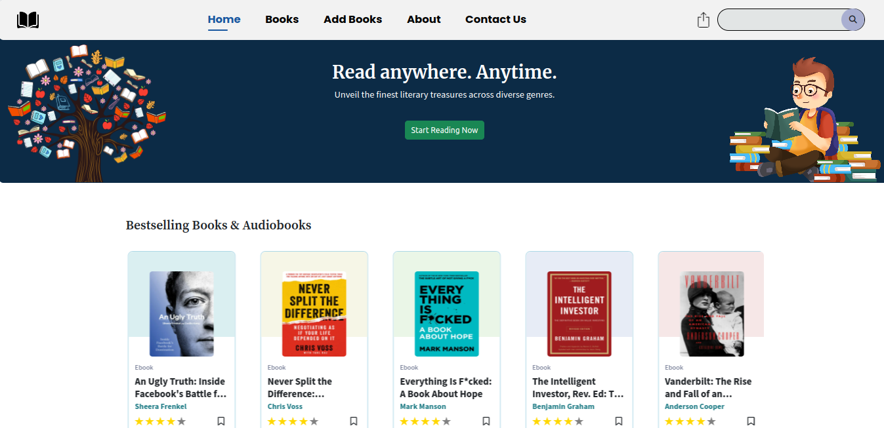
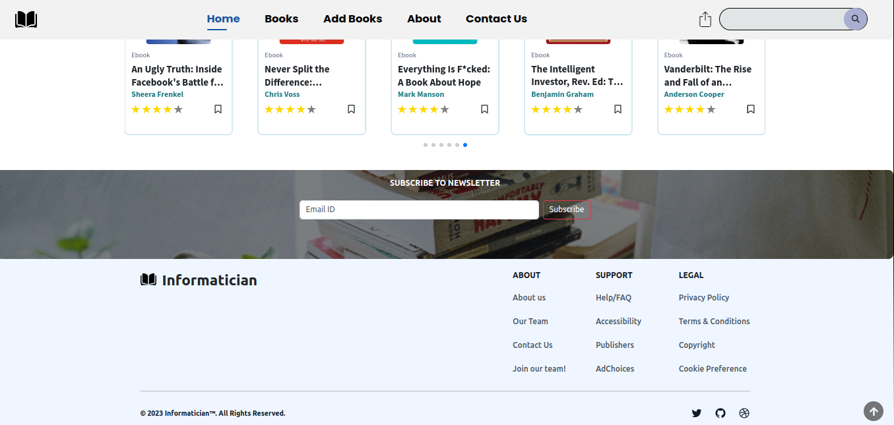

<h1 align=center> InforMaticiaN </h1>

<p align=center>
Welcome to Informatician, an open-source book platform where literature meets community, and knowledge knows no bounds. Our web application is designed to revolutionize the way you engage with books, offering a comprehensive book listing and reading experience similar to popular platforms like Kindle and Scribd. The application goes beyond a mere reading experience, as it allows you to rate and review books, fostering a sense of community and sharing insights with fellow book enthusiasts. You can explore a vast collection of books, search for your favorite titles, and even contribute by adding new books to the platform. Whether you're an avid reader, a literary connoisseur, or simply seeking new knowledge, Informatician is here to provide you with an exceptional platform to explore, learn, and connect.</p>


--


---

<div align="center">


<br>

 
 
  
 
 
</div>

## ✨ Features

- **Book Contribution**: Contribute to the platform by adding new books, enriching the library for the entire community to enjoy. 

- **Comprehensive Book Listing**: Explore a vast collection of books from various genres and categories, including fiction, non-fiction, science fiction, fantasy, biographies, and more.

- **Personal Library**: Users can curate their own digital library by adding new books to the platform.

- **Rating and Review**: Share opinions and insights by rating and reviewing books.

- **Seamless Reading Experience**: Enjoy a comfortable reading experience within the application.

- **Authentication and Authorization**: User accounts with secure authentication and authorisation.

- **Responsive Design**: The application features a responsive design, making it accessible and visually appealing across various devices, including desktops, tablets, and mobile phones.


## 💻 Tech Stack 

  &nbsp;
  &nbsp;
  &nbsp;
  &nbsp;


## ✨ How to install it? 

1. Clone the repository:
 ```sh
 $ git clone https://github.com/openeon/informatician.git
 ```

2. Install dependencies:
```sh
 $ npm install
```

4. Start the application:
```sh
 $ npm start
```

 💻 The application can be accessed in a web browser at `http://localhost:3000`.


## ✨ Contributing Roadmap

 - Go through the [CONTRIBUTING.md](https://github.com/poorvika11/informatician/blob/main/CONTRIBUTING.md) file, where all the guidelines have been mentioned that will guide you to make your contribution.
 - Do checkout the [Code of Conduct](https://github.com/poorvika11/informatician/blob/main/STYLE_GUIDE.md) section.

 ✨ If you have any questions or need assistance, feel free to open an issue in the repository. <a name="roadmap"

Join us on this open-source journey, and let your love for books flourish in a limitless world of possibilities.


## ✨ Thank You for Your Contribution!
<p align=center>
<a href="https://github.com/rohansx/informatician/graphs/contributors">
  
</a></p>

🙏  Thank you for your exceptional contribution. We look forward to your continued involvement and collaboration as we strive to enhance Informatician and provide an exceptional book platform for users around the world.

🌟 We value the time and effort you put into contributing in improving Informatician and helping us create a vibrant and user-friendly environment for book enthusiasts, and we look forward to reviewing and merging your contributions. Your dedication, skills, and commitment have played a crucial role in making Informatician the incredible platform it is today.

✨ Once again, thank you for your contribution!


## ✨ Authors

[Rohan Sharma](https://github.com/rohansx) - Main Developer
<a name="changelog"></a>


## ✨ License

The project is licensed under the [MIT License](https://github.com/rohansx/informatician/blob/main/LICENSE).

---